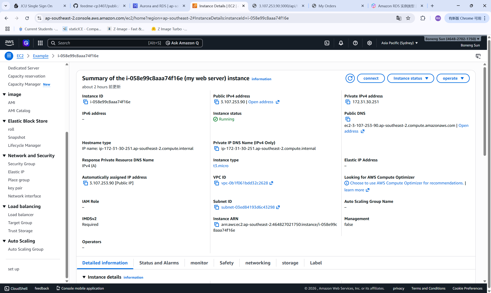
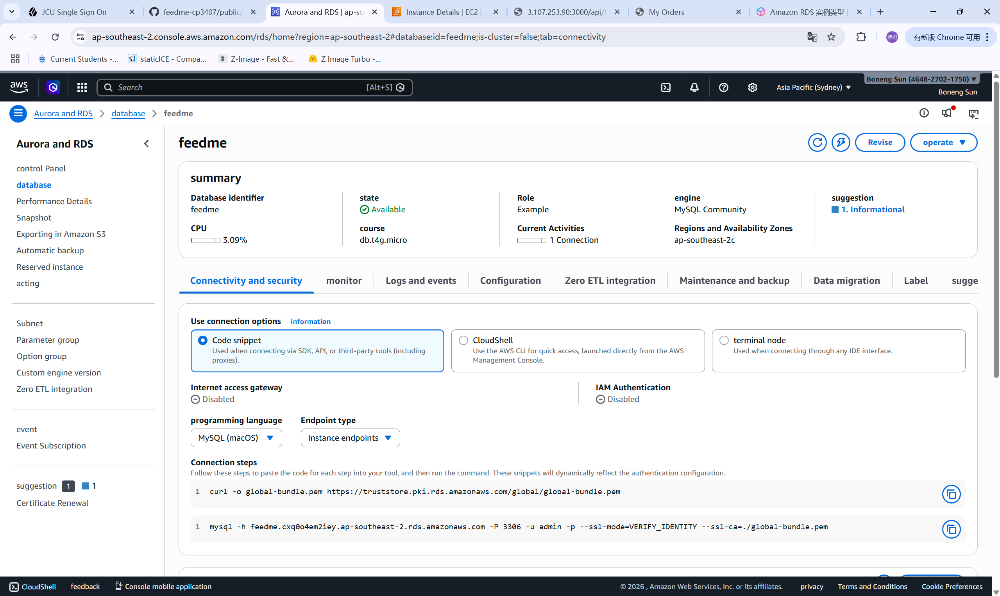
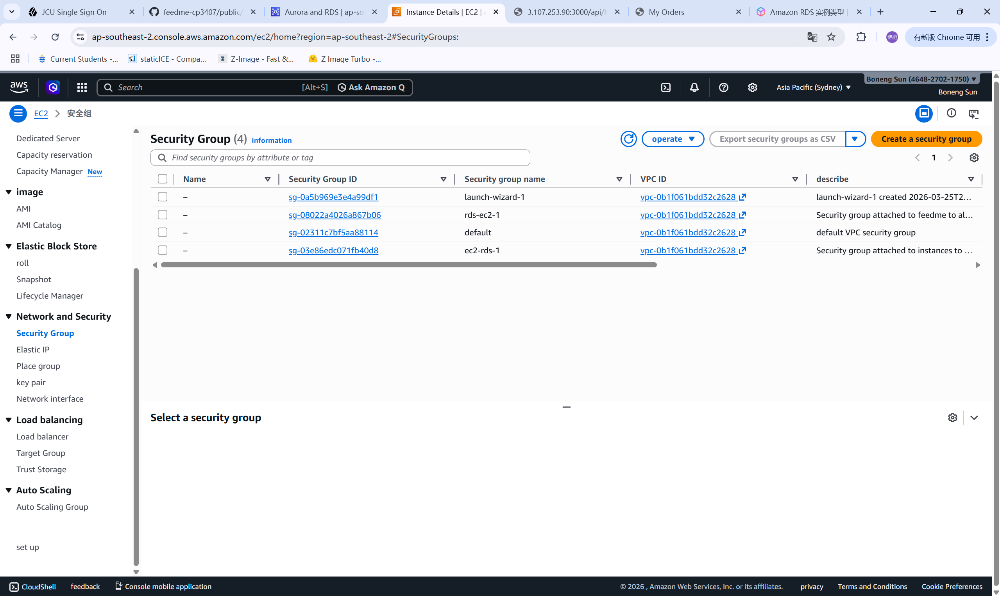
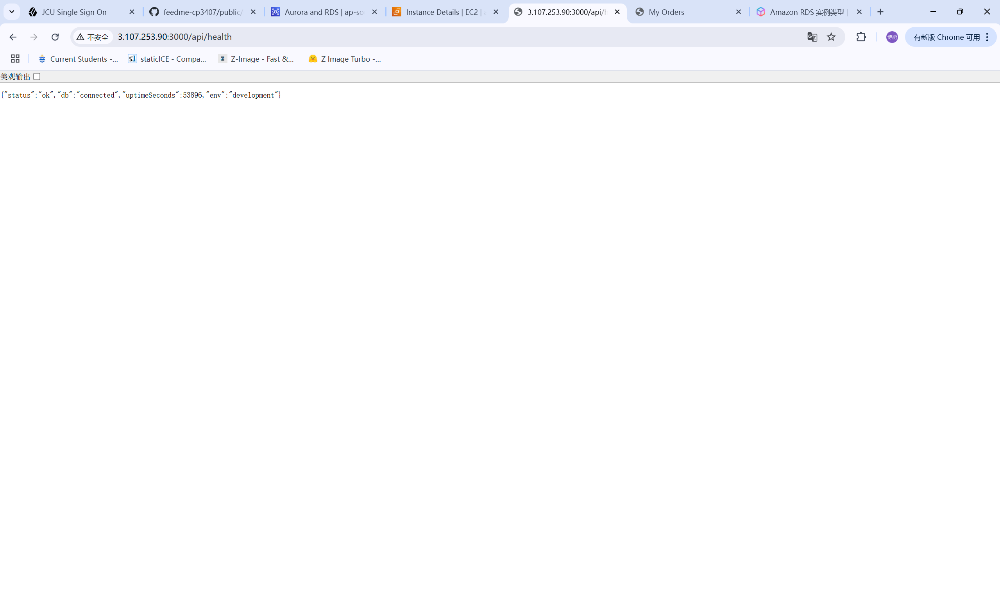
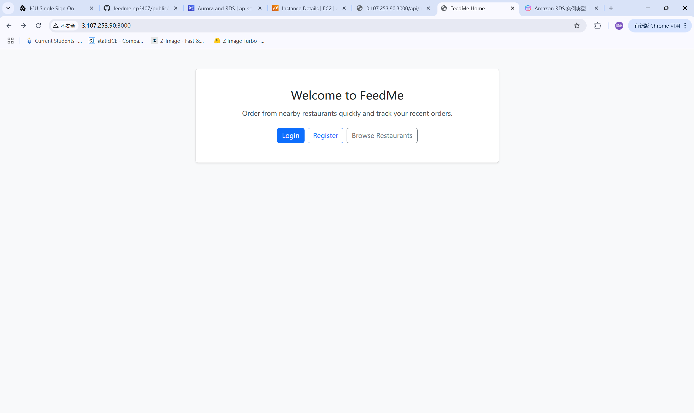

# Cloud Evidence Log

This page records captured cloud deployment evidence for FeedMe.

## 1. Cloud Setup Summary

1. Backend is configured to read settings from `backend/.env`.
2. Database settings are externalized through environment variables.
3. PM2 process configuration exists for EC2 deployment.
4. The application is intended to run on EC2 with MySQL on RDS.

## 2. Captured Evidence

1. Screenshot of EC2 instance status page.
2. Screenshot of RDS instance status page.
3. Screenshot of security group inbound rules.
4. Screenshot or log of `/api/health` returning `status: ok`.
5. Screenshot of the app homepage running from the cloud URL.
6. Screenshot of register/login/order/my-orders flow in the cloud environment.

## 3. What to Show in a Demo

1. Show the deployed URL opening in a browser.
2. Run the health check.
3. Demonstrate login and order flow.
4. Explain that the database connection comes from RDS and the app reads secrets from environment variables.

## 4. Assessment Value

1. Confirms use of modern cloud services.
2. Shows that the project is not only local-only.
3. Gives the marker concrete proof of deployment readiness.

## 5. Captured Screenshots

### EC2 Instance Screenshot

### RDS Instance Screenshot

### Security Group Screenshot

### Cloud Health Check Screenshot

### Cloud App Homepage Screenshot

### Cloud End-to-End Flow Screenshot

