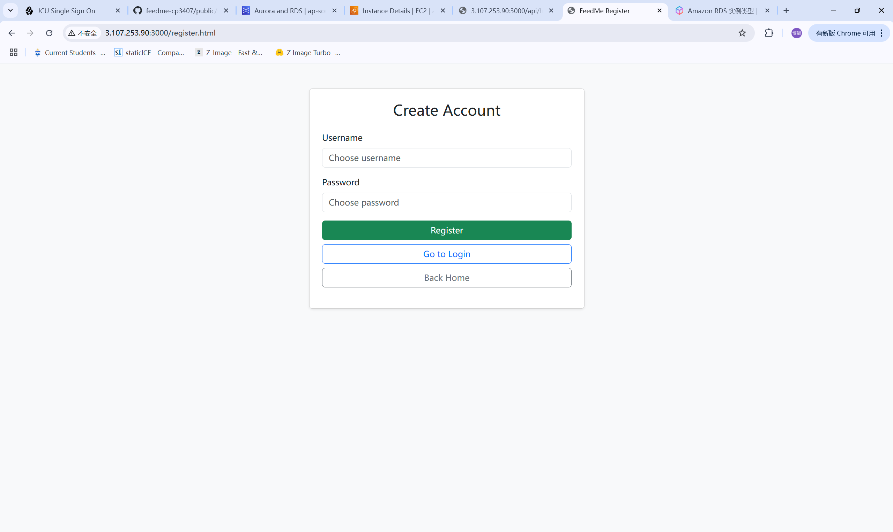
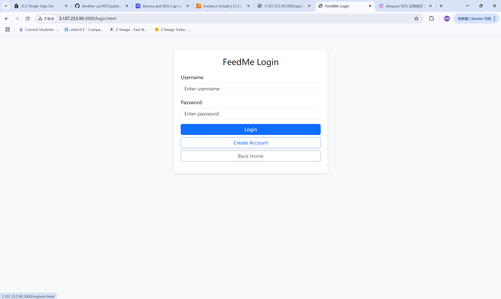
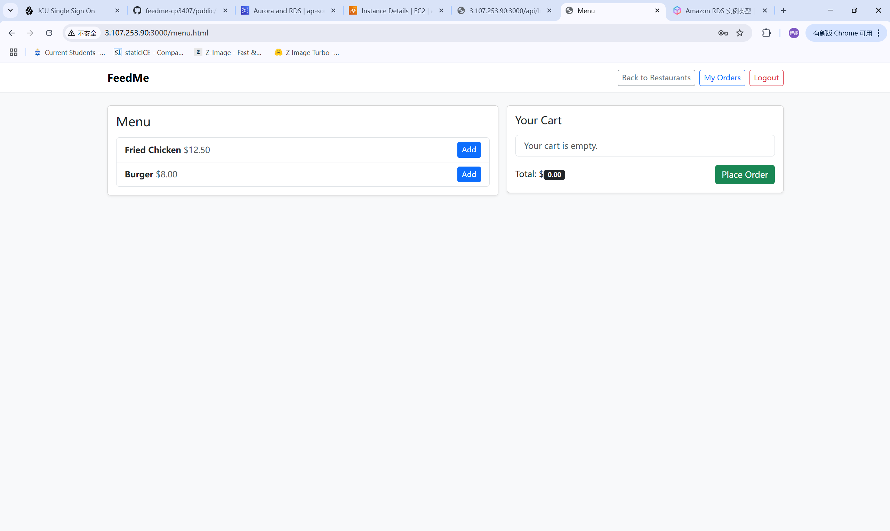
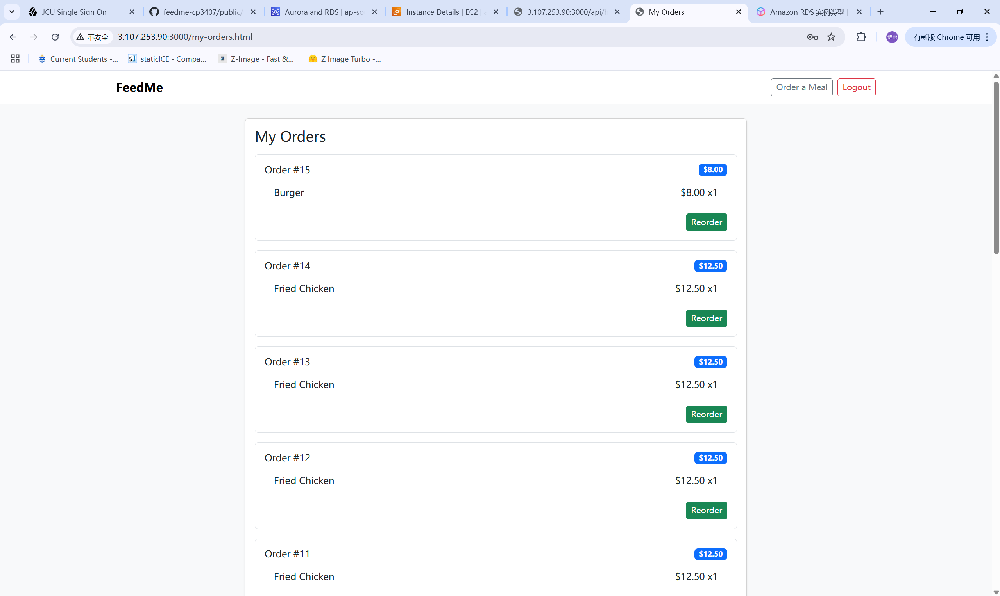
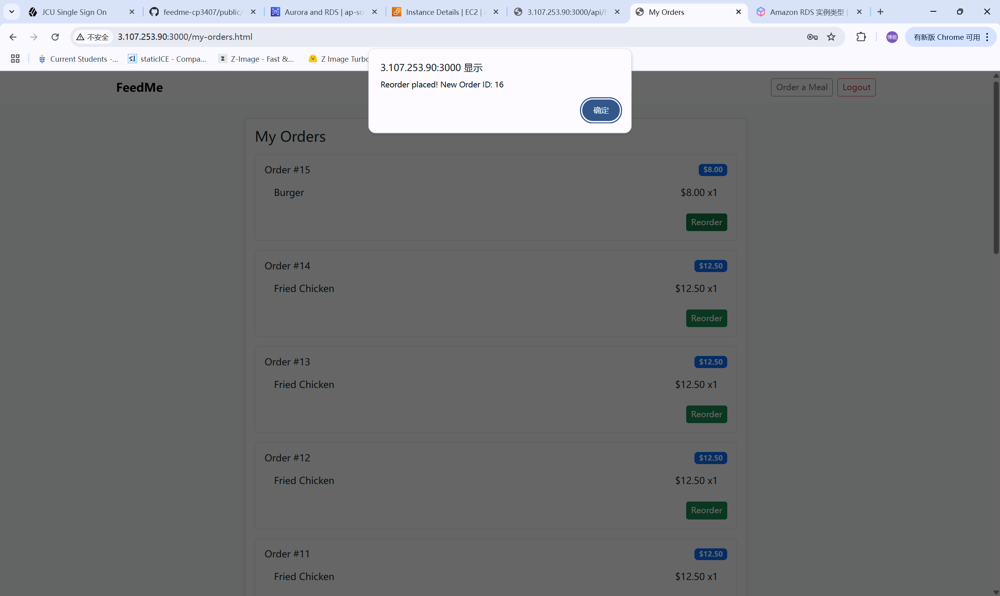

# Testing Evidence

This page records the completed manual smoke tests for FeedMe.

## 1. Smoke Test Scope

The goal of smoke testing is to confirm that the main end-to-end path works after code changes:

1. Register a new user.
2. Log in with that account.
3. Browse restaurants.
4. Open a menu.
5. Place an order with multiple items.
6. View itemized order history.
7. Reorder from my-orders.
8. Check the health endpoint.

## 2. Completed Test Cases

### Test Case 1: Health Endpoint

- Step: Open `/api/health`.
- Expected: status is `ok` and database shows `connected`.
- Result: Pass.

### Test Case 2: Registration and Login

- Step: Register a fresh user, then log in with the same credentials.
- Expected: Registration succeeds, login returns a valid token, and protected pages work.
- Result: Pass.

### Test Case 3: Order Creation

- Step: Add multiple menu items, change quantities, and submit the order.
- Expected: Order is created successfully and appears in my-orders.
- Result: Pass.

### Test Case 4: Itemized Order History

- Step: Open my-orders after placing an order.
- Expected: Item names, prices, quantities, and total are visible.
- Result: Pass.

### Test Case 5: One-Click Reorder

- Step: Use the reorder action from my-orders.
- Expected: A new order is created using the same restaurant and items.
- Result: Pass.

## 3. What the Tests Demonstrate

1. The backend starts successfully.
2. Authentication and protected routes work together.
3. Database writes are visible in order history.
4. The reorder feature uses stored item details correctly.

## 4. Notes for the Marker

1. These are manual smoke tests, not automated unit tests.
2. They are still useful because they cover the full visible user journey.
3. Screenshots are attached in this document as direct evidence.

## 5. Captured Screenshots

### Health Endpoint Screenshot

### Register and Login Screenshot

### Order Creation Screenshot

### My-Orders Screenshot

### Reorder Screenshot

